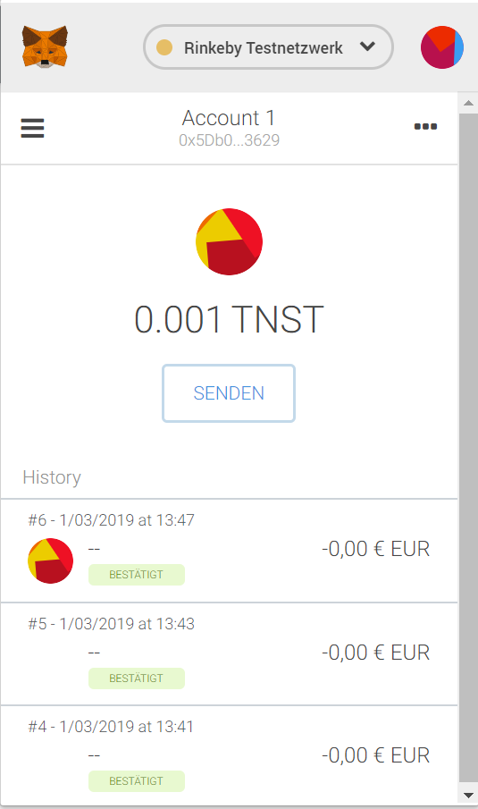
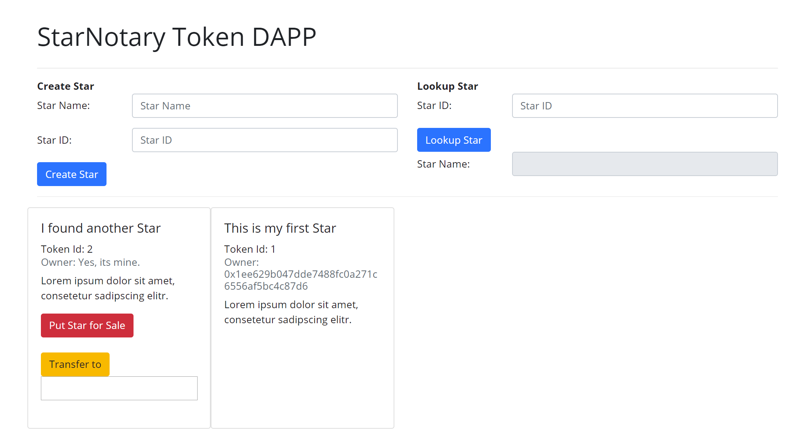
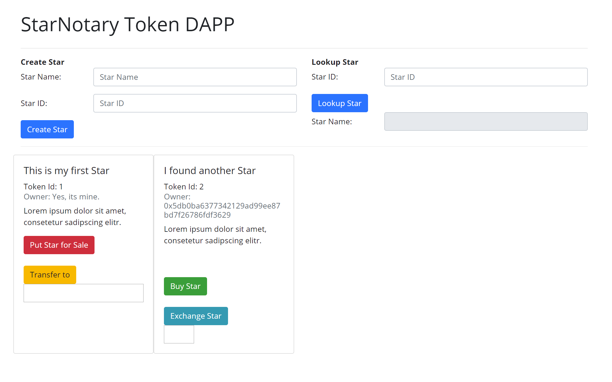

# Decentralized Star Notary Service - Starter Code

This token is deployed to **Rinkeby Testnet**.

**ERC-721 Token Name**: "Tobis Notray Star Token"  
**ERC-721 Token Symbol**: "TNST"  
**Token/Smart Contract Address**: [0x2c8f26da031204a555212a3852bfd04ba2aff2d7](https://rinkeby.etherscan.io/address/0x2c8f26da031204a555212a3852bfd04ba2aff2d7)

0x424897699C20cD1d9d8792480231ffbd1640C80B  

**Account 1**: [0x5Db0Ba6377342129ad99eE87BD7f26786fdF3629](https://rinkeby.etherscan.io/address/0x5db0ba6377342129ad99ee87bd7f26786fdf3629)  
**Account 2**: [0x1ee629B047DdE7488FC0A271C6556AF5bC4c87d6](0x1ee629B047DdE7488FC0A271C6556AF5bC4c87d6  )

**Create First Star TX**: [0x946231975af68ae1cb9fe1e446d0a1eb4a0180748e46e032d7216779fa480a38](https://rinkeby.etherscan.io/tx/0x946231975af68ae1cb9fe1e446d0a1eb4a0180748e46e032d7216779fa480a38)  
**TX from Account 1 to Account 2**: [0xcf99c0acbfaa8f429a55343468ce6b2a562c38ba1849a572ca2e72b30fe03bb9](https://rinkeby.etherscan.io/tx/0xcf99c0acbfaa8f429a55343468ce6b2a562c38ba1849a572ca2e72b30fe03bb9)

Once installed, go into your cloned directory, and run:  
```npm install```

For starting the development console, run:  
```truffle develop```

For compiling the contract, inside the development console, run:  
```compile```

For running unit tests the contract, inside the development console, run:  
```test```

For migrating the contract to the locally running ethereum network, inside the development console, run:  
```migrate --reset```

For running the Front End of the DAPP, open another terminal window and go inside the project directory, and run:  
```npm run dev```

Open the DAPP in Browser [http://localhost:8080/]()


#### Possible improvements of the current version.
* Currently only jQuery is used for the GUI, with a framework like VUE, React, Angular, etc. 
the frontend can be implemented more efficient and maintainable.
* The test cases could be extended to check for expected errors.
* The price for buying/selling is currently fixed at 1, this should be flexible.
* For an Exchange, the exchange should be confirmed by both users.


#### Screenshots

##### Metamask


##### GUI (Same state show on Account 1 and Account 2)


